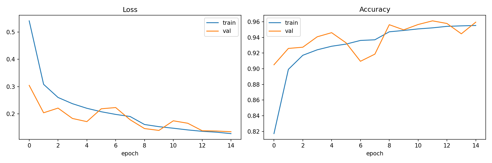
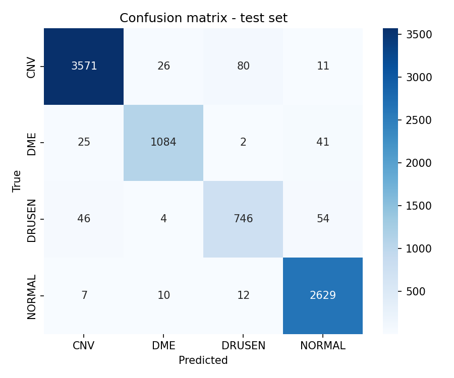
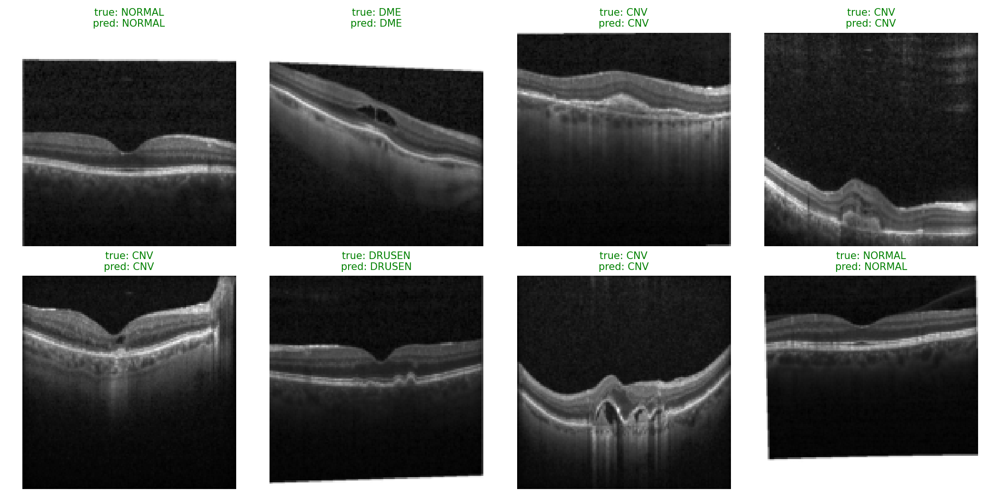

# Retinal Disease Classification from OCT Scans

Classifies retinal OCT (optical coherence tomography) images into 4 diagnostic categories: **CNV**
(choroidal neovascularization), **DME** (diabetic macular edema), **DRUSEN**, and **NORMAL**.

## Problem

OCT is a non-invasive optical imaging technique used to capture cross-sectional images of the retina.
Automated triage of OCT scans by likely diagnosis can help prioritize cases for review. This project
builds a convolutional neural network **from scratch** (no pretrained/transfer-learning weights) to
classify scans into the 4 categories above.

## Dataset

[Kermany et al. OCT2017](https://www.kaggle.com/datasets/paultimothymooney/kermany2018) — ~84,000 labeled
OCT images, sourced from Kermany DS, Goldbaum M, et al., *Identifying Medical Diagnoses and Treatable
Diseases by Image-Based Deep Learning*, Cell, 2018.

## Approach

- Custom CNN (`OCTNet`): 4 conv blocks (conv → batchnorm → ReLU, doubled per block) with max pooling,
  global average pooling, and a dropout-regularized classifier head. ~1.5M parameters, trained from random
  initialization.
- Class-weighted cross-entropy loss to correct for the dataset's class imbalance.
- Mild augmentation (small rotations/translations, brightness/contrast jitter) — no flips, since OCT
  scans have a consistent anatomical orientation.
- 80/10/10 train/val/test split carved from the training set (the provided Kaggle test split is too small
  — ~32 images/class — for reliable evaluation).

## Results

| Metric | Value |
|---|---|
| Test accuracy | 96.2% |
| Test macro F1 | 94.6% |

DRUSEN was the hardest class to classify (88.3% F1), consistent with it having the fewest training
examples (850 vs. 3688 for CNV) — the class-weighted loss helped narrow this gap but didn't fully close it.





## Limitations / next steps

- Trained on a fixed 128×128 resolution to keep training fast on a free GPU; higher resolution may
  improve detection of subtle drusen deposits.
- No test-time augmentation or ensembling.
- Could compare against a transfer-learning baseline (e.g., pretrained ResNet18) to quantify what
  training from scratch costs in accuracy versus what it gains in domain-specific features.

## Reproducing

```bash
pip install -r requirements.txt
```

Open `retinal_oct_classification.ipynb` in Google Colab, upload your `kaggle.json`
(kaggle.com → Settings → Create New API Token), and run all cells top to bottom.
